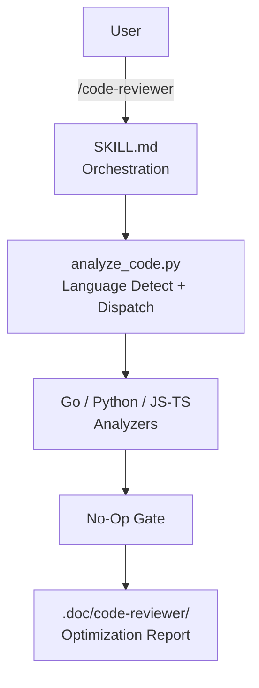

> [!NOTE]
> This README was generated by [SKILL](https://github.com/agenvoy/skill-readme-generate), get the ZH version from [here](./doc/README.zh.md). 
> This skill's implementation was fully agent-generated; the developer only tuned its input/output.

***

  <strong>AST-DRIVEN CODE REVIEWS THAT SKIP THE NOISE!</strong>

***

> A Claude Code skill that generates optimization reports for Go, Python, and JavaScript/TypeScript via AST analysis, entropy-based secret detection, and a no-op gate

## Table of Contents

- [Features](#features)
- [Architecture](#architecture)
- [License](#license)

## Features

> `/code-reviewer [PROJECT_PATH] [OUTPUT_FILE]` · [Documentation](./doc/doc.md)

- **AST-Driven Multi-Language Analysis** — Go is parsed via a `go/ast` helper, Python via the built-in `ast` module, and JS/TS via a lightweight brace-based structural scan for functions and nesting depth; each degrades gracefully to string scanning when its toolchain is unavailable.
- **Entropy-Based Secret Detection** — Beyond keyword matching, suspicious strings are scored with Shannon entropy and filtered against UUID/MD5/SHA1/SHA256/MIME-type patterns to cut false positives in credential detection.
- **No-Op Gate** — When both issue counts and actionable recommendations are zero, the skill skips directory creation and file writes entirely, reporting a single "nothing to do" line instead of an empty report.
- **Self-Checked Recommendation Principles** — `recommendation_principles.md` hard-bans wrapping existing abstractions, speculative optimizations, and decorative refactors — every suggestion must anchor to a real file and line number.
- **Automatic Go Preprocessing** — Every non-test `.go` file is run through `gofmt -s -w` before analysis, silently skipped on failure so the pipeline never breaks.

## Architecture

> [Full Architecture](./doc/architecture.md)

## License

This project is licensed under the [MIT LICENSE](LICENSE).

***

©️ 2026
