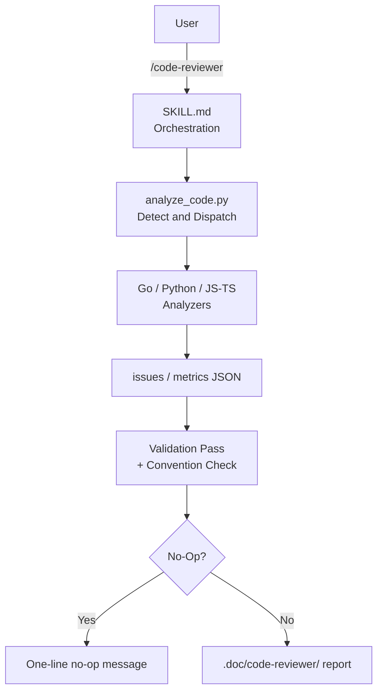

> [!NOTE]
> This README was generated by [SKILL](https://github.com/agenvoy/skill-readme-generate), get the ZH version from [here](./doc/README.zh.md). 
> This skill's implementation was fully agent-generated; the developer only tuned its input/output.

***

<strong>AST-DRIVEN CODE REVIEWS THAT SKIP THE NOISE!</strong>

***

> An agent skill with AST-based multi-language analysis, per-finding source validation, and project convention checks

## Table of Contents

- [Features](#features)
- [Architecture](#architecture)
- [License](#license)

## Features

> `/code-reviewer [PROJECT_PATH] [OUTPUT_FILE]` · [Documentation](./doc/doc.md)

- **AST-Driven Multi-Language Analysis** — Go runs through a `go/ast` helper that attaches source snippets, Python uses the built-in `ast`, and JS/TS gets a structural scan plus the project's eslint, each degrading to string scanning when its toolchain is missing.
- **Per-Finding Validation Pass** — Every issue and suggestion is re-checked against the source before it reaches the report, and anything unconfirmed is dropped rather than downgraded so false positives never erode trust in the rest.
- **Project Convention Adherence** — Code is checked against the `CLAUDE.md` / `AGENTS.md` files in its own directory and parents, each violation quotes the rule verbatim, and trade-offs already marked with `nolint` or a comment are skipped.
- **Entropy-Based Secret Detection** — Beyond keywords, suspicious strings are scored by Shannon entropy and filtered against UUID, hash, and MIME-type patterns to cut false positives in credential detection.
- **No Report Without Findings** — With zero issues and no actionable suggestions, it creates no directory and writes no file, and suggestions themselves are barred from speculative or decorative content.

## Architecture

> [Full Architecture](./doc/architecture.md)

```mermaid
graph TB
    User[User] -->|/code-reviewer| SKILL[SKILL.md<br/>Orchestration]
    SKILL --> Analyze[analyze_code.py<br/>Detect and Dispatch]
    Analyze --> Lang[Go / Python / JS-TS<br/>Analyzers]
    Lang --> JSON[issues / metrics JSON]
    JSON --> Validate[Validation Pass<br/>+ Convention Check]
    Validate --> Gate{No-Op?}
    Gate -->|Yes| Msg[One-line no-op message]
    Gate -->|No| Report[.doc/code-reviewer/ report]
```

## License

This project is licensed under the [MIT LICENSE](LICENSE).
