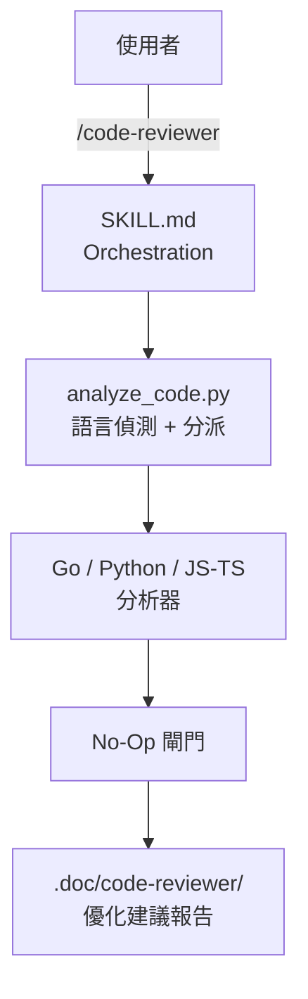

> [!NOTE]
> 此 README 由 [SKILL](https://github.com/agenvoy/skill-readme-generate) 生成，英文版請參閱 [這裡](../README.md)。 
> 此 skill 的實作內容全由 agent 生成，開發者僅針對 input / output 進行調整。

***

  <strong>AST-DRIVEN CODE REVIEWS THAT SKIP THE NOISE!</strong>

***

> Claude Code skill，透過 AST 分析、熵值密鑰偵測與 No-Op 閘門，為 Go、Python、JavaScript/TypeScript 生成優化建議報告

## 目錄

- [功能特點](#功能特點)
- [架構](#架構)
- [授權](#授權)

## 功能特點

> `/code-reviewer [PROJECT_PATH] [OUTPUT_FILE]` · [完整文件](./doc.zh.md)

- **AST 驅動的多語言分析** — Go 透過 `go/ast` helper、Python 透過內建 `ast` 模組、JS/TS 透過輕量 brace-based 結構掃描解析函式與巢狀深度，對應工具鏈不可用時自動降級為字串掃描並標註。
- **熵值密鑰偵測** — 除關鍵字比對外，對高熵字串計算 Shannon entropy 並排除 UUID／MD5／SHA1／SHA256／MIME type 誤判，降低密鑰偵測的假陽性。
- **No-Op 閘門** — 當問題數與有效建議皆為零時，跳過建立目錄與寫檔，只回報一行「無需處理」訊息，避免產生空洞報告。
- **建議產出的自我檢查規則** — `recommendation_principles.md` 硬性禁止包裝既有抽象、預測性優化、裝飾性重構等廢話建議，每條建議都必須錨定實際檔案與行號。
- **Go 前處理自動化** — 分析前對每個非測試 `.go` 檔案自動執行 `gofmt -s -w`，失敗時靜默略過不中斷流程。

## 架構

> [完整架構](./architecture.zh.md)

## 授權

本專案採用 [MIT LICENSE](../LICENSE)。

***

©️ 2026
