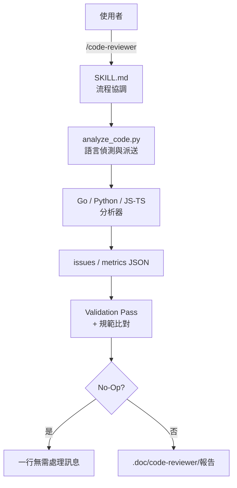

> [!NOTE]
> 此 README 由 [SKILL](https://github.com/agenvoy/skill-readme-generate) 生成，英文版請參閱 [這裡](../README.md)。 
> 此 skill 的實作內容全由 agent 生成，開發者僅針對 input / output 進行調整。

***

<strong>AST-DRIVEN CODE REVIEWS THAT SKIP THE NOISE!</strong>

***

> Agent Skill，具備 AST 多語言分析、逐條錨點驗證與專案規範遵循檢查

## 目錄

- [功能特點](#功能特點)
- [架構](#架構)
- [授權](#授權)

## 功能特點

> `/code-reviewer [PROJECT_PATH] [OUTPUT_FILE]` · [完整文件](./doc.zh.md)

- **AST 驅動的多語言分析** — Go 走 `go/ast` 輔助程式並附原始碼片段、Python 用內建 `ast`、JS/TS 做結構掃描並串接專案 eslint，工具鏈缺失時降級為字串掃描並標註。
- **逐條錨點驗證** — 每條問題與建議寫入報告前都回原始碼再確認一次，確認不了的直接移除而不是降級保留，避免假陽性拖垮整份報告的可信度。
- **專案規範遵循** — 依檔案所在目錄與父目錄的 `CLAUDE.md`／`AGENTS.md` 比對，每條違規逐字引用原文，已用 `nolint` 或註解說明取捨的不列。
- **熵值密鑰偵測** — 關鍵字之外以 Shannon entropy 評分可疑字串，並排除 UUID、雜湊與 MIME type，降低憑證偵測的誤報。
- **無事不產檔** — 零問題且無有效建議時不建立目錄、不寫檔，只回一行「無需處理」，建議本身也禁止預測性與裝飾性內容。

## 架構

> [完整架構](./architecture.zh.md)

```mermaid
graph TB
    User[使用者] -->|/code-reviewer| SKILL[SKILL.md<br/>流程協調]
    SKILL --> Analyze[analyze_code.py<br/>語言偵測與派送]
    Analyze --> Lang[Go / Python / JS-TS<br/>分析器]
    Lang --> JSON[issues / metrics JSON]
    JSON --> Validate[Validation Pass<br/>+ 規範比對]
    Validate --> Gate{No-Op?}
    Gate -->|是| Msg[一行無需處理訊息]
    Gate -->|否| Report[.doc/code-reviewer/報告]
```

## 授權

本專案採用 [MIT LICENSE](../LICENSE)。
