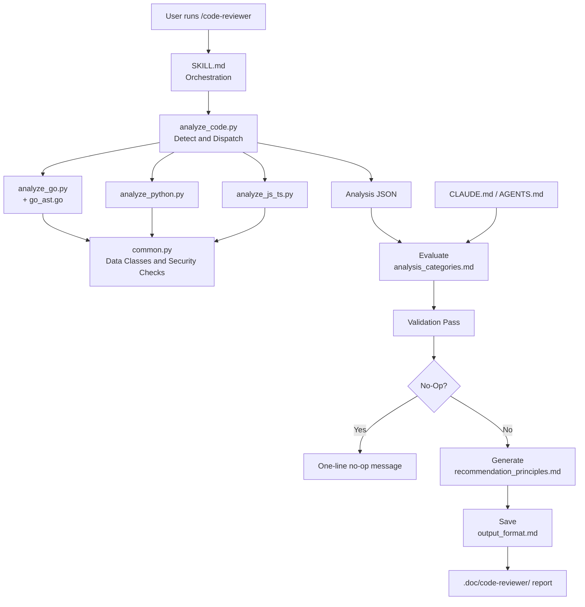
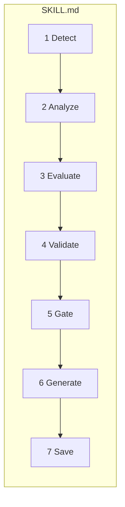
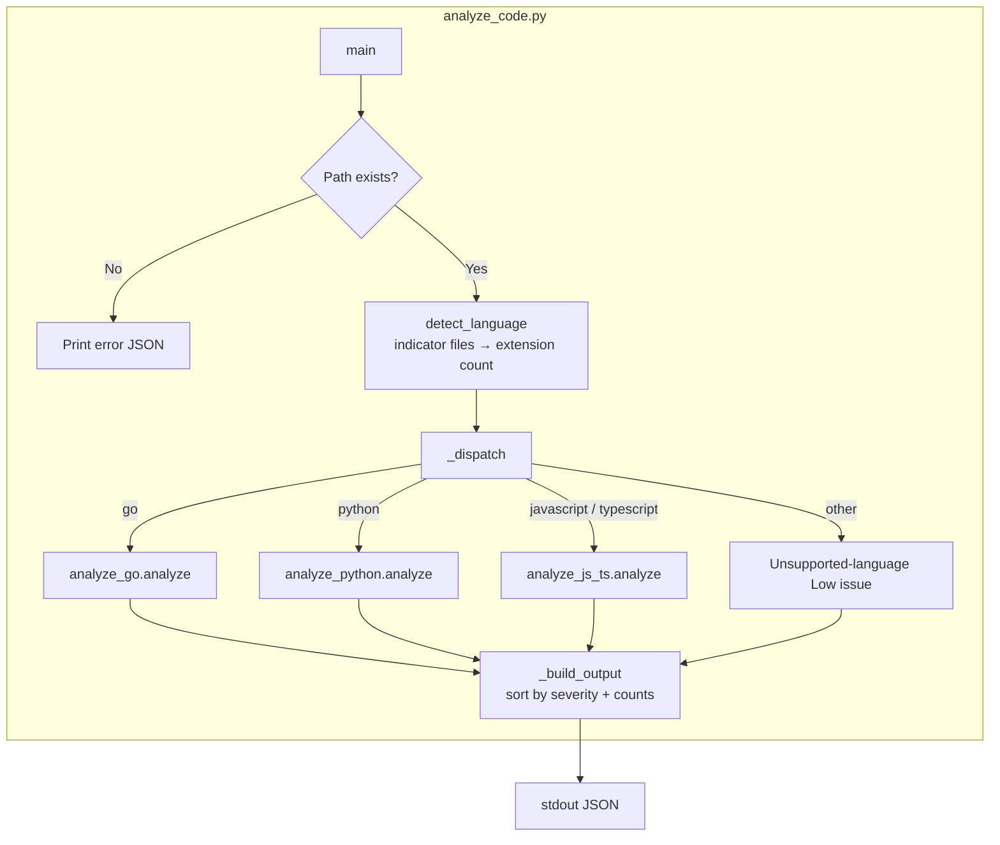
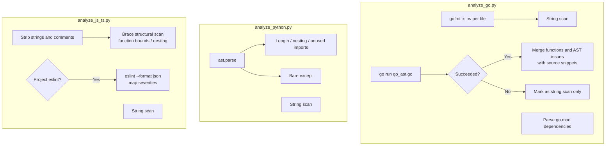
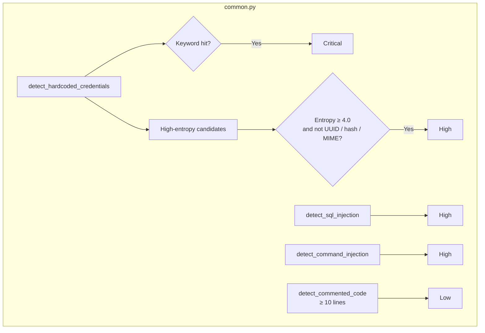
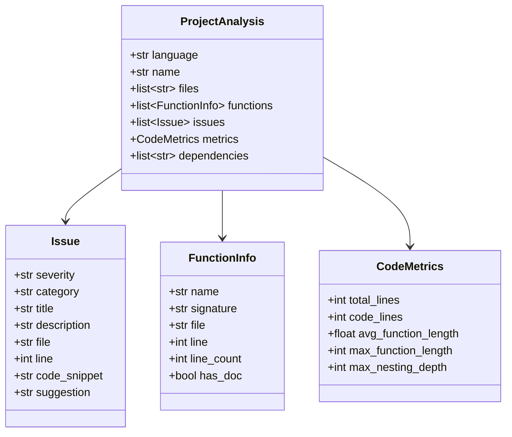
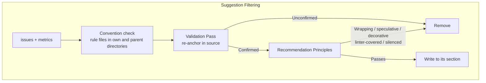
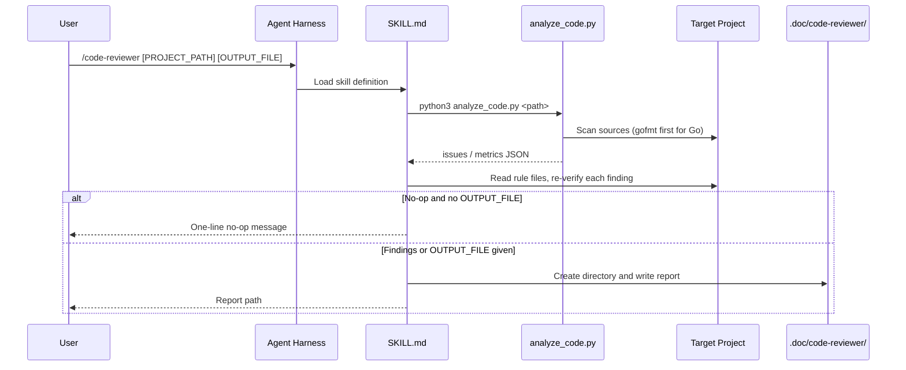
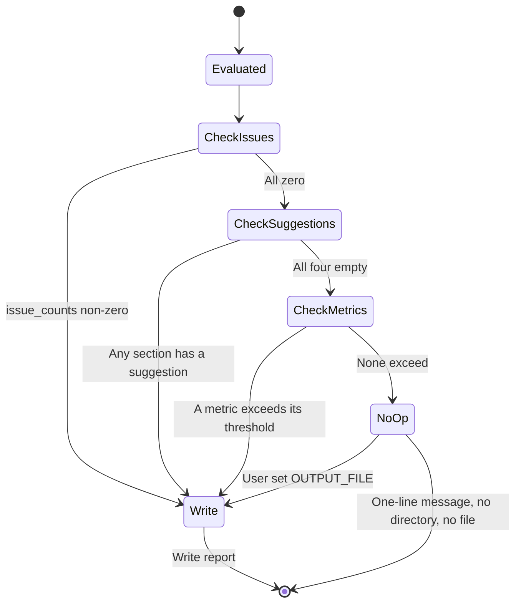

# code-reviewer - Architecture

> Back to [README](../README.md)

## Overview

## Module: SKILL.md (Orchestration)

Defines arguments, the seven-step workflow, the Validation Pass, convention scope, no-op conditions, and the checklist; the analyzer path uses `{skill_dir}`, resolved from the actual load location.

## Module: analyze_code.py (Entry)

## Module: Language Analyzers

## Module: common.py (Shared Data and Security Checks)

## Module: Suggestion Filtering (Evaluate → Generate)

## Data Flow

## No-Op State Machine

