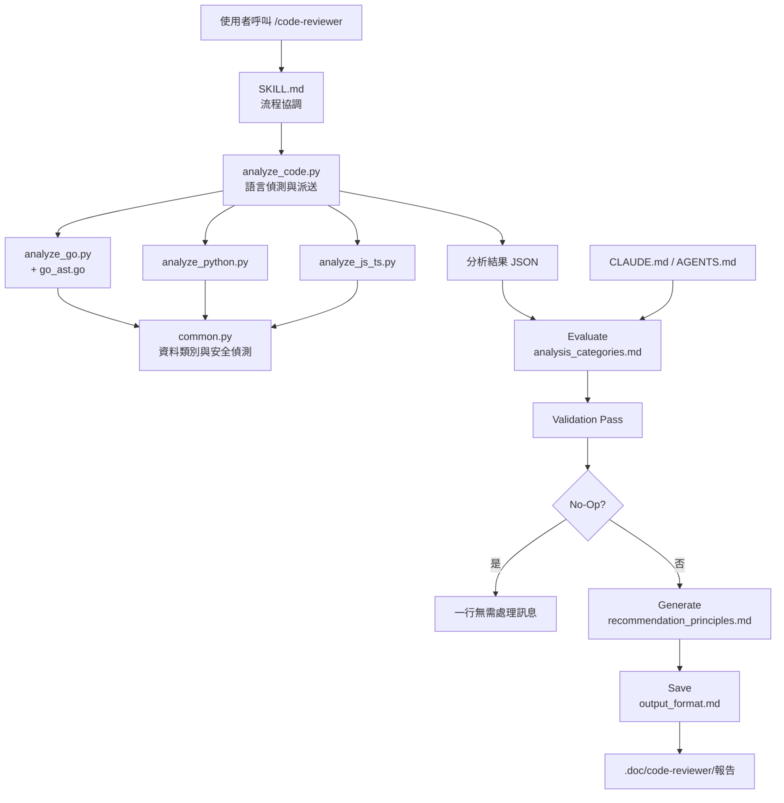
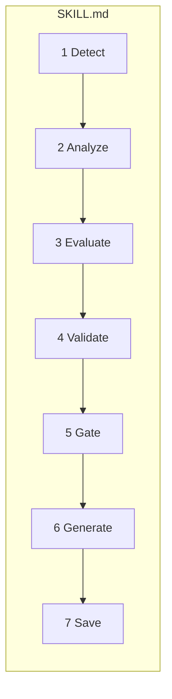
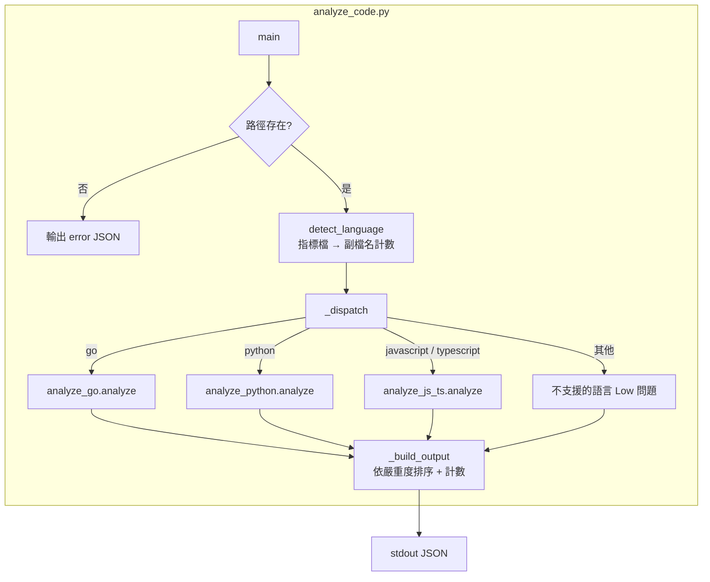
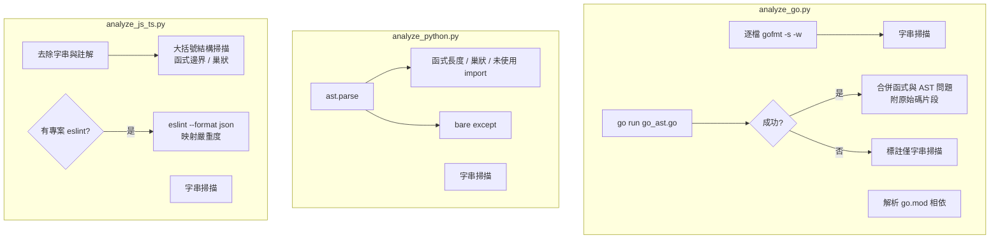
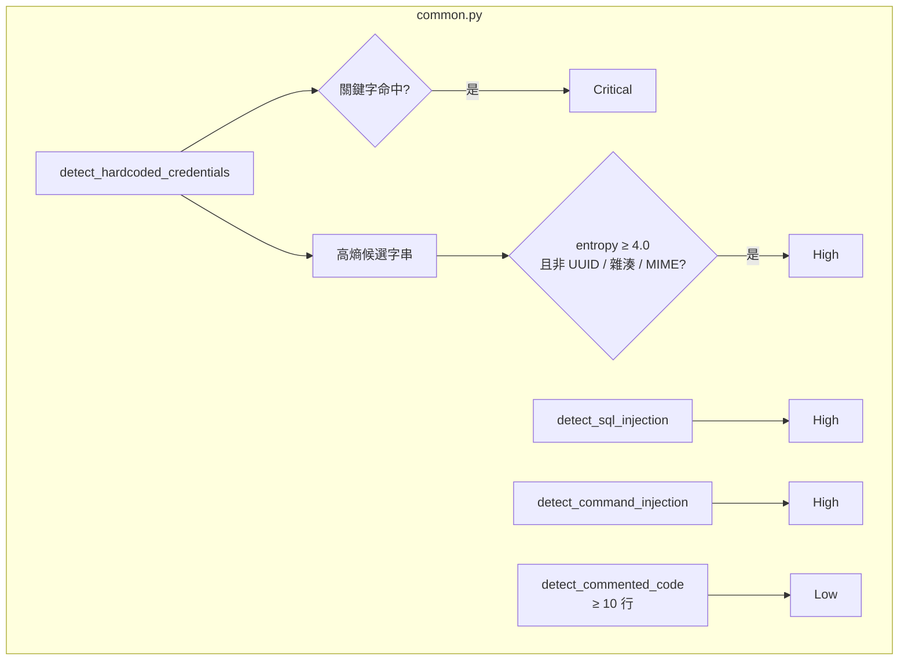
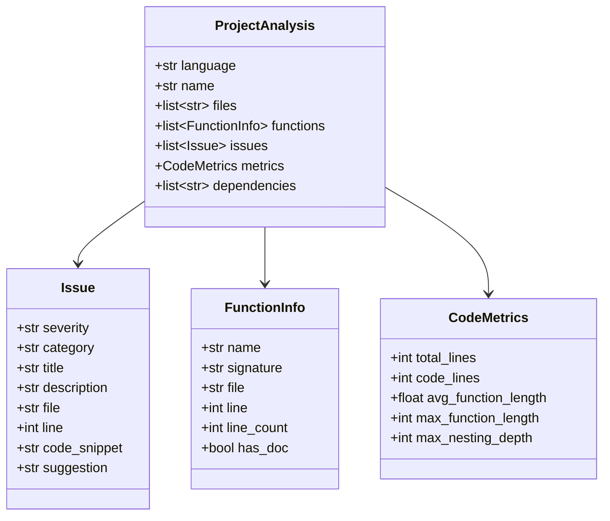
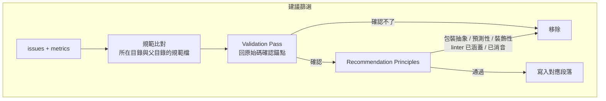
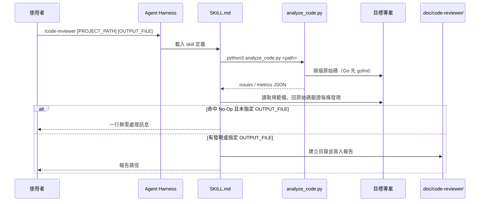
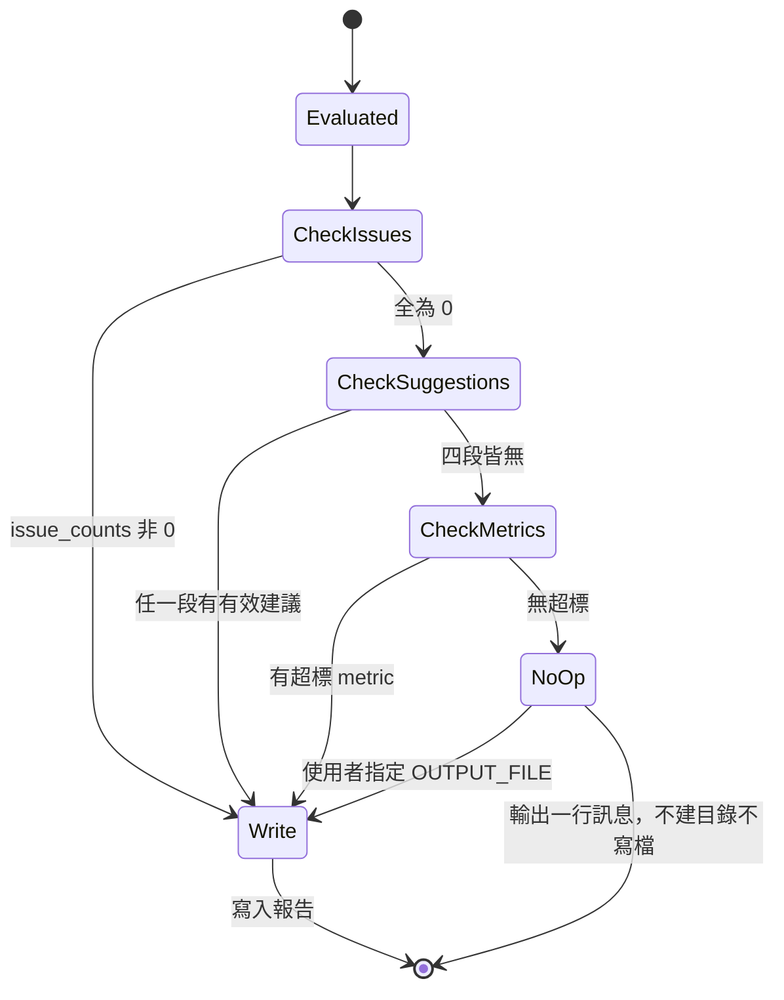

# code-reviewer - 架構

> 返回 [README](./README.zh.md)

## 概覽

## Module: SKILL.md（流程協調）

定義參數、七步工作流程、Validation Pass、規範遵循範圍、No-Op 條件與驗證清單；分析器路徑以 `{skill_dir}` 表示，依實際載入位置代入。

## Module: analyze_code.py（入口）

## Module: 語言分析器

## Module: common.py（共用資料與安全偵測）

## Module: 建議篩選（Evaluate → Generate）

## 資料流

## No-Op 狀態機

